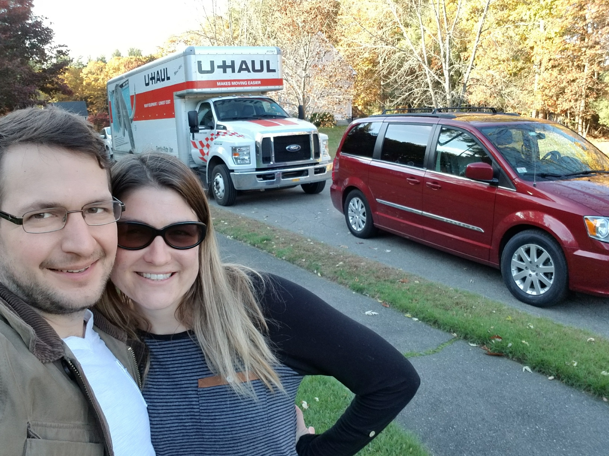

It was time. After 2 1/2 years in the Boston area, we decided it was time to head back South.

## Why now?

We had been talking about it since we came up, but started thinking about it more seriously after searching for a house to buy (we had been renting) but not finding something we liked. Then it hit me: It was going to get harder to move away from New England the longer we stayed there. Why? Because our oldest was already in 3rd grade and our youngest will start Kindergarten next year. Acton was feeling more like home in some ways, but still too far from home (and family) for us to want to fully put down roots. So, if it was going to just get harder over time, then the sooner the better.

Speaking of family, living far away is hard. We were spending a lot of time and money traveling down South for holidays, and still only seeing family a couple of times a year. That was hard on the kids and us.

## Why Charleston?

We first visited Charleston for Christmas of 2011. The photo doesn't show it, but this was during a pretty rough time in our lives and there was no guarantee we were going to hold our young family together.

We've come back quite a few times on vacation since then and thought about living here since then. Once we started looking more intently, we started weighing all the things we liked and disliked about it against everything we liked and disliked about being in MA. Some of the other big things we liked about the Charleston area:

1. Historic area (one of the things we loved about Boston)
2. Weather (which we also liked in Boston, except for like November and February/March)
3. Beach
4. Big enough town that I can find people working in lots of different kinds of tech
5. Cost of living (not quite as cheap as we were thinking it would be, but still cheaper than MA)
6. Food. The food here is excellent.

The expected downside was schools. Massachusetts has absolutely amazing schools. Once we started looking at schools in this area though, we found that Mount Pleasant also has really good schools, and we came down and toured several and decided to give things a try. We've been quite happy with that part of the decision so far as well.

## Life Lessons

So we've been here a few months and I thought it would be worth reflecting on things I've learned in the process.

### Follow your opportunities, but keep evaluating your priorities

Moving up to Boston was an awesome opportunity. It was only feasible for us because I chased a series of opportunities that came up with my company. The opportunity hadn't ended, but in continuing to evaluate our life priorities, we decided it was time to move on. I'm incredibly thankful for my time there and I'll carry those experiences with me the rest of my life. I could have kept going with my career in Boston, but that would have been at the cost of family, so it was time to move on.

### If it sounds crazy but feels right, find a way to run a small experiment

We were getting increasingly confident that a move down was the right thing, but our kids had never been here while thinking about living here, so we took a crazy weekend trip down (we drove on a Thursday and back up on a Monday) We toured 5 schools and lined up a realtor to look at 7 or 8 houses the next day. We went to the beach and took a horse drawn carriage tour. By the end of the weekend, everyone was confident it was a good plan and the kids were on board. We found a house we liked and made an offer. There were obviously numerous hurdles to get over still, but we had enough data to feel confident we were making the right decision.

### Have the shrimp and grits

Seriously, if you come visit, get the shrimp and grits. They're different at every restaurant, but they're always delicious.
