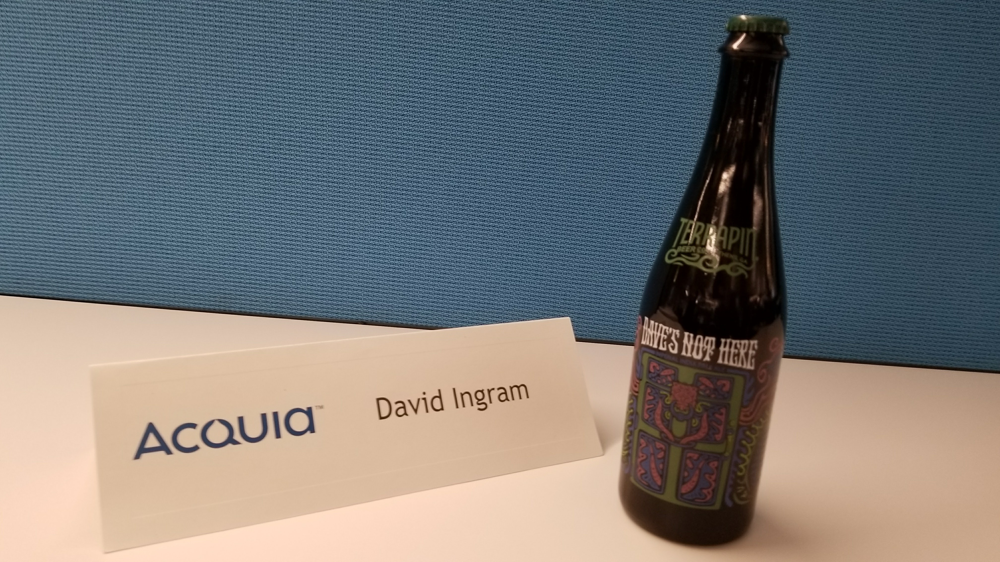

It's been one heck of a ride.

It really has. As I sign off today, I'm also signing off from my nearly 5 years at Acquia. I couldn't even begin to make it through the list of all of the people I want to thank for all they've taught, given and helped me to become. So if you're reading this, you know who you are. Thank you. I've been reminiscing in my last weeks though, so if you care to read the very brief story of my time at Acquia, here it is:

## Portland, OR and climbing aboard.

I joined Acquia in 2013 as the Solutions Architect for the Southeast. At the time we were 300 or so employees, headquartered in Burlington, and the SA team was just over 10 people. There was no employee in Southeast aside from one sales guy, and I came on to help explain Drupal and Acquia's products to prospective customers.

When I went to DrupalCon in Portland, OR that year, I wasn't specifically looking for a job, and I didn't know what a Solutions Architect was. I met Rick Vugteveen on I think the first evening though and we got to chatting and he asked if I'd ever considered working at Acquia. I knew Acquia, but hadn't given it that much thought. As we discussed the available roles, he convinced me that an SA was a pretty great thing to be and that I should come and talk to some other folks at the Acquia booth the next day. (I found out soon after I started that Acquia pays referral bonuses if you help recruit people, but I still choose to believe that Rick liked me and thought I'd be a good addition to the company.) Anyway, I chatted with a bunch of a good people and decided to give things a whirl.

About 3 weeks later I wrapped up some projects I was working on and headed off to Boston for on-boarding.

## Catching the itch and building a product

About two months in, I had spent time with enough customers to catch the buzz around personalization and I was less than excited about the story we told at the time. I heard some other folks talking about this as well and started putting some ideas out there. As I'd been doing Drupal development for a number of years, I decided to sketch out an architecture and write a simple Drupal module one weekend that would handle some basic personalization. From that effort, the (Personalize Module)[drupal.org/project/personalize] was born, and then later the full Acquia Lift product. Once the momentum started building, I worked with my good friend and colleague Katherine Bailey for several months before we had anyone else on the team, and we built out a good part of the MVP for Lift. We had a few others join the team and eventually rolled out Lift V1 in February of 2014.

I continued to work as an SA during this time, but as we got closer to launch my time rolled more and more into Product and I was spending less time doing anything unrelated to personalization.

## Product Management and moving to Boston

Finally, at the end of 2014, we made the decision to move from Charlotte, NC where we were living at the time and move up to Boston to take on a full time Product role and work towards the next major version of Lift.

The team had already grown considerably, and my time in Boston allowed me to work much more closely with an incredible number of amazing people. We rolled out Lift 2 soon after with some decent UX updates, but the real goal was already insight, to revamp the UI and architecture entirely. We rolled out what we internally called "Lift 3" at our Engage conference in 2016.

<blockquote class="twitter-tweet" data-lang="en">
Dave Ingram of <a href="https://twitter.com/acquia?ref_src=twsrc%5Etfw">@acquia</a> talks about re-engineering/ rebuilding Lift. <a href="https://twitter.com/hashtag/AcquiaEngage?src=hash&amp;ref_src=twsrc%5Etfw">#AcquiaEngage</a> <a href="https://t.co/1eTH7dgGaI">pic.twitter.com/1eTH7dgGaI</a>
&mdash; Hijinio Reynoso (@hijinior) <a href="https://twitter.com/hijinior/status/793892831890960384?ref_src=twsrc%5Etfw">November 2, 2016</a></blockquote>

Following the Lift launch, I started working on a new but related project that we eventually called "Journey", and just one year later we launched [Acquia Journey](https://www.acquia.com/products-services/acquia-journey), a tool for orchestrating omni-channel user experiences in real time.

<blockquote class="twitter-tweet" data-lang="en">
Watch: <a href="https://twitter.com/daveaingram?ref_src=twsrc%5Etfw">@daveaingram</a> on how orgs can orchestrate cohesive <a href="https://twitter.com/hashtag/customerjourneys?src=hash&amp;ref_src=twsrc%5Etfw">#customerjourneys</a> that deliver on the promise of <a href="https://twitter.com/hashtag/omnichannel?src=hash&amp;ref_src=twsrc%5Etfw">#omnichannel</a> <a href="https://t.co/0wRYE2WhLW">https://t.co/0wRYE2WhLW</a> <a href="https://t.co/ZD1uKLH78I">pic.twitter.com/ZD1uKLH78I</a>
&mdash; Acquia (@acquia) <a href="https://twitter.com/acquia/status/954428291879972865?ref_src=twsrc%5Etfw">January 19, 2018</a></blockquote>

I learned an incredible amount about what it takes to build and manage a software product, and made my fair share of mistakes along the way. I'm proud of what we accomplished and am honored to have worked with such an amazing team across all of Acquia along the way.

## Heading back South, then moving on

As I already wrote, we decided after considerable deliberation to [move back South to Charleston, SC](/moving-to-charleston). I knew it would be difficult to keep up my momentum as a Product Manager while working remotely, but wanted to give it my best shot. It turned out to indeed be a big challenge to stay well connected to HQ through a series of management changes, and I decided it was time to move on to new adventures.

## So what's next?

So, today is my last day of the Acquia chapter of my life. I'm going to leave what's next as a bit of a cliff hanger, partly for the suspense, and partly because I'm still working out the details. But what's life without a little adventure?
